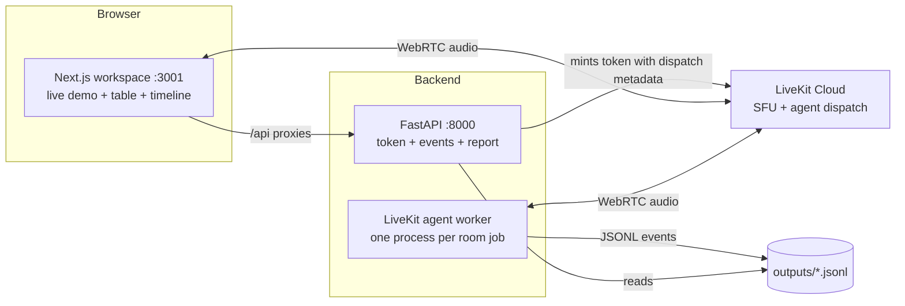
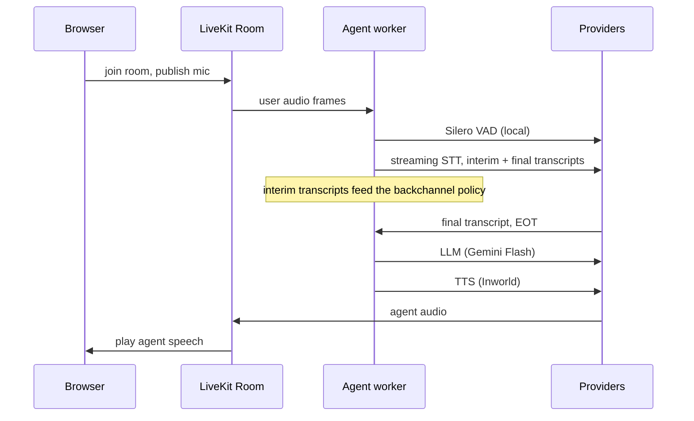
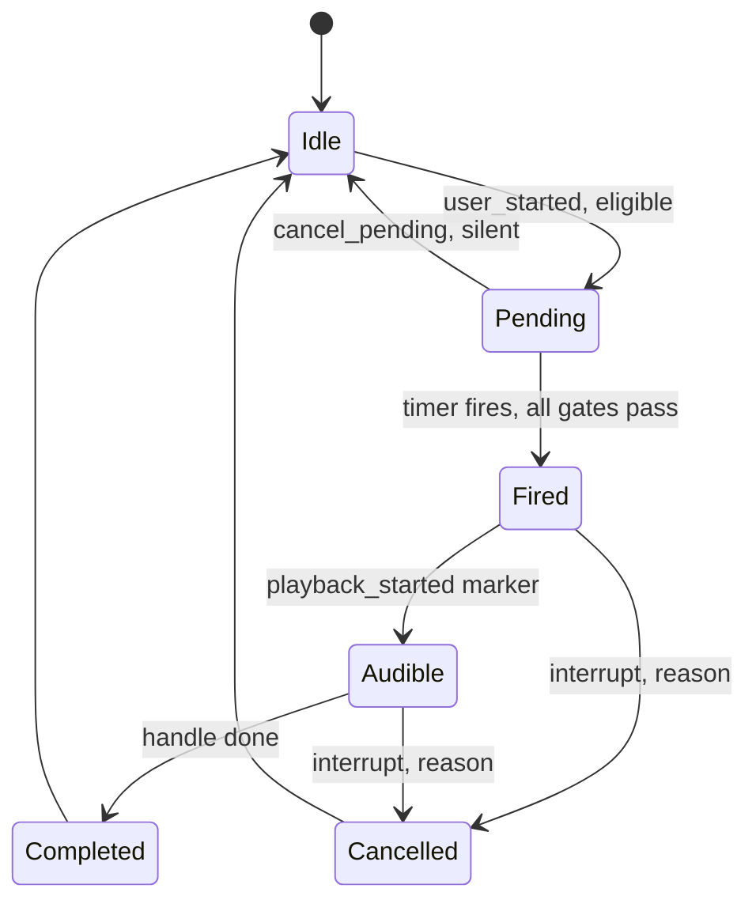
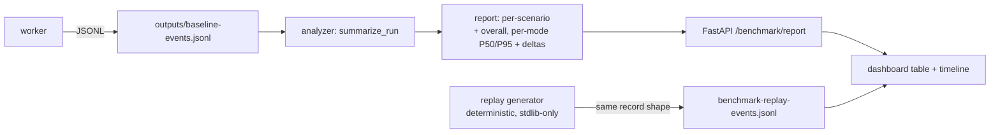

# Realtime Voice Chat — Complete First-Principles Explanation

> **What this is.** An interview-ready walkthrough of the Blue Machines SDE-1 assignment —
> *"Build backchanneling for LiveKit and prove its impact"* — covering the problem, the
> architecture, every design decision, every tradeoff, the measurement design, the known
> weaknesses, and the questions an interviewer is likely to ask.
>
> **Grounded in code.** Every claim below comes from reading the actual tree. Line numbers
> drift as the repo evolves (it was being actively edited while this was written) — when in
> doubt, search for the **symbol name** in the referenced file.
>
> **Status as of writing:** test suite 86 passed · `ruff check` clean · `ruff format --check`
> clean · `compileall` OK.

---

## 0. The elevator pitch

A LiveKit voice agent that **acknowledges the user while they are still speaking** — "mm-hmm",
"uh-huh", "I see" — the way humans do, **without ever slowing down or breaking the agent's real
response**. The system ships three switchable modes (baseline / timer backchannel / semantically
gated backchannel), a JSONL event contract that powers live runs *and* a deterministic replay,
a benchmark analyzer with paired P50/P95 deltas, a FastAPI inspection API, and a Next.js
workspace with a live demo, a comparison table, and a per-run conversation timeline.

The one-sentence thesis:

> **The hard part is not playing "mm-hmm". It's committing to speech under uncertainty in a
> shared one-way medium, and proving you did it without harming the real conversation — so the
> engine is one safety choke point, the semantic layer can only ever *withdraw* approval, and
> the only latency anchors trusted are audible-playback markers.**

---

## 1. The problem, from first principles

### 1.1 Why backchanneling exists

Human listeners don't stay silent while someone talks. They say "mm-hmm", "right", "okay" —
short signals that mean *"I'm here, keep going."* Voice agents that stay silent until the user
finishes feel unnatural over long turns. But the assignment is explicit that the difficulty is
not the audio:

> *"The challenge is doing this without breaking turn-taking or increasing the latency of the
> agent's actual response."* — ASSIGNMENT.MD

### 1.2 The four physical constraints

Everything in this repo is a consequence of these:

1. **Speech is a one-way shared medium.** Only one mouth holds the conversational floor. A
   backchannel is a deliberate, *small* floor violation — accepted by humans only while it
   stays short and instantly yields.
2. **A late backchannel is worse than none.** If "mm-hmm" arrives after the user stops, it
   becomes a delayed interruption colliding with the agent's real answer. The decision must be
   made *mid-speech*, from incomplete information (interim transcripts, partial audio).
3. **An LLM conversation is append-only history.** If the cue enters the chat context, the LLM
   sees its own filler as an assistant turn and can self-condition on it — and the benchmark
   can no longer compare fairly against baseline.
4. **Decisions are made under uncertainty that resolves asynchronously.** The user may stop
   50 ms after you commit. TTS takes hundreds of ms. A classifier may answer late. The core
   engineering problem is *managing committed-but-uncertain async work* — cancellation, races,
   stale results — which is exactly the "Things We Expect You to Think About" section of the
   assignment, and the single biggest scoring bucket (real-time / async correctness: 25%).

### 1.3 The latency budget (why this is hard in numbers)

Roughly what a turn costs end-to-end in a hosted pipeline like this one:

| Stage | Typical cost | Repo evidence |
|---|---|---|
| VAD detects end of speech | ~200–500 ms of trailing silence | Silero, inside `AgentSession` |
| STT finalization | ~100–400 ms | LiveKit Inference streaming STT |
| LLM TTFT | measured ~1.9–2.0 s P50 on real runs | `pipeline_metric` (llm/ttft) |
| TTS TTFB | measured ~428–445 ms P50 | `pipeline_metric` (tts/ttfb) |
| Network/WebRTC round trips | ~50–150 ms each way | LiveKit room transport |

Human conversational gaps are ~200 ms median. No hosted pipeline hits that. So agents are
*inherently* late, and the social purpose of a backchannel is to **fill the dead air with a
signal that the agent is listening** — while never adding to the latency the user actually
experiences on the real answer.

---

## 2. System architecture

Three cooperating processes, started by `scripts/dev-stack.sh`:



Key structural facts:

- **The browser never sees provider credentials.** Only the Python API mints LiveKit tokens
  (`api.py::livekit_token`); the Next.js app talks to it through thin route proxies.
- **Explicit agent dispatch.** The token embeds `{"scenario_id", "mode", "run_id"}` as
  `RoomAgentDispatch.metadata` — so a room *starts with its experiment configuration fixed*.
  The worker reads it (`agent.py::entrypoint` → `benchmark.py::parse_run_context`) and **locks
  the mode for the whole run** (`locked_mode`).
- **One worker process per room job.** `entrypoint` is deliberately module-scope so it can be
  pickled across LiveKit's process boundary; settings are re-read inside the child process.
- **Public APIs only** — the assignment forbids modifying LiveKit or using private APIs. All
  LiveKit imports are public modules; speech handles are duck-typed via `getattr`, never
  reaching into internals.

---

## 3. The main pipeline (the "boring" half)



Documented flow (README): `browser mic → LiveKit room → Silero VAD → streaming LiveKit Gemini
STT → Gemini Flash → LiveKit Inference TTS → browser audio`.

### 3.1 Provider choices and why

| Stage | Default | Alternative shipped | Why this default |
|---|---|---|---|
| VAD | Silero (local) | — | The most latency-critical signal (speech/silence boundaries) must not depend on a network |
| STT | LiveKit Inference `google/gemini-3.5-transcribe-live` | Groq Whisper (final-only), `groq_rest` | **Streaming with interim transcripts** — interims are the raw material for mid-speech decisions; also reuses LiveKit credentials (no extra vendor key) |
| LLM | Gemini 2.5 Flash | OpenRouter with up to 2 free fallback models | The pipeline is TTFT-dominated; Flash trades model quality for first-token latency |
| TTS | LiveKit Inference `inworld/inworld-tts-2` (voice "Ashley") | ElevenLabs direct, `gemini_tts` | Bundled with LiveKit creds; first-audio-byte latency matters more than voice quality here |

Mode gating (in `entrypoint`): Jev mode **requires** an STT provider with interim results and a
`TYPESAFE_API_KEY`, and fails loudly with `ConfigurationError` otherwise.

### 3.2 The mode contract

| Mode | Enabled | Semantic gate | Cooldown | Cap per turn |
|---|---|---|---|---|
| `baseline` | no | — | — | — |
| `backchannel` | yes | no (pure timer) | 4.0 s | 1 |
| `jev_backchannel` | yes | yes (Jev) | 1.8 s | 5 |

Same engine, same code paths — **only policy parameters differ**. That is what makes the A/B
comparison legitimate.

---

## 4. The backchannel engine (the interesting half)

`backchannel.py` — deliberately knows nothing about LiveKit or the LLM. The caller supplies a
`play()` function that returns an interruptible handle. This keeps timing behavior deterministic
and unit-testable.

### 4.1 State machine



- **Pending**: one `asyncio` timer task; wait = `delay − elapsed_since_turn_start`
  (so the delay doubles as the minimum-speech gate).
- **Fired**: the timer wakes and re-checks *everything* — generation, enabled, still speaking,
  agent not busy, budget, semantic approval, EOT probability vs threshold, cooldown. Only then:
  `backchannel_decision` → `play()` → handle → `backchannel_started`.
- **Audible**: `session.output.audio.on("playback_started")` → `mark_audio_started()` →
  `backchannel_audio_started`. *The only honest "reached the speaker" marker.*
- **Completed**: handle done → `backchannel_completed` with `duration_ms` measured from
  `_audible_at` (not from handle creation).
- **Collision**: if the user yields within `collision_window_seconds` (0.5 s) of the cue
  becoming audible, `backchannel_collision` is emitted once per cue, carrying
  `ms_since_audible` and `window_ms` — the turn-taking damage signal.

### 4.2 The race discipline (this is what scores "real-time correctness")

1. **Generation counter (monotonic epoch).** Every world-changing event bumps it — eight sites:
   new turn, user stopped, agent busy, disabled, mode switch, approval withdrawn, EOT
   suppression, shutdown. The value is **stamped into the task at creation**, re-checked
   **at fire time**, and again **after playback starts** (post-play race check). Any stale
   task silently kills itself. Cheap, lock-free, no interleaved-await hazards.
2. **One in-flight task, one active handle.** `_schedule_if_eligible` refuses a second timer
   while one is pending; a cue stays "active" until LiveKit reports the handle complete, so a
   new approval can never create overlapping playback.
3. **Two teardown funnels only.** `_cancel_pending()` (silent — nothing was audible) and
   `_interrupt_active(reason=…)` (`handle.interrupt(force=True)` + `backchannel_cancelled`).
   Every cancellation path carries a machine-readable reason; a test asserts *every reachable
   path reports its reason*.
4. **Self-cancel guard.** The cue's own speech raises an "agent speaking" event; the engine
   ignores busy-transitions while its own handle exists (`_starting_backchannel` /
   `_active_handle` guards), so it never kills itself.

### 4.3 All cancellation triggers

| Trigger | Reason | Emitted |
|---|---|---|
| User yields the floor | `user_stopped` | `backchannel_cancelled` |
| Agent takes the floor | `agent_busy` | `backchannel_cancelled` |
| Runtime disable | `disabled` | `backchannel_cancelled` |
| Mode switch | `mode_switch` | `backchannel_cancelled` |
| Approval withdrawn | `semantic_rejected` | `backchannel_cancelled` |
| Shutdown | `shutdown` | `backchannel_cancelled` |
| Post-play race re-check | `post_play_race` | `backchannel_cancelled` |
| EOT likely (pending timer only) | — | `backchannel_suppressed_eot` |

### 4.4 How the cue is played

```python
session.say(cue_text,
            allow_interruptions=False,
            add_to_chat_ctx=False,
            audio=<pre-cached WAV frame>)   # live TTS only as fallback
```

- **`add_to_chat_ctx=False`** — the cue never enters the LLM conversation. It is *heard, not
  said*: no history pollution, no self-conditioning, and the benchmark cannot miscount it as an
  agent response.
- **`allow_interruptions=False`** — counterintuitive but essential: LiveKit defers
  *interruptible* speech until user silence, which would guarantee the cue plays late. The
  engine instead takes interruption responsibility itself and force-interrupts on floor change.
- **Pre-cached WAVs** — `assets/backchannels/{mm-hmm,uh-huh,i-see}.wav`, loaded once per worker
  process into `rtc.AudioFrame`s and replayed with **zero TTS synthesis**. Tradeoff: instant and
  consistent, but the voice is frozen; live TTS is the fallback when a clip is missing.

### 4.5 Why the real response structurally cannot get slower

1. **No await edges from policy to pipeline.** The reply path (STT→LLM→TTS) and the engine share
   *inputs* (events) but never share *awaits*. Jev classification is a fire-and-forget task; the
   engine never blocks the session.
2. **History isolation.** `add_to_chat_ctx=False` keeps the LLM's input byte-identical to
   baseline.
3. **Instant floor yield.** Force-interrupt on user-stop/agent-busy, and the cue's speech is
   labeled `backchannel_agent_speaking` — never `agent_response_started`.
4. **Residual cost is bounded and measured:** worst case is a still-audible cue overlapping the
   user's final syllables — that is exactly what `backchannel_collision` counts.
   *You can't architect it away entirely; you measure it.*

---

## 5. The Jev semantic layer (`jev.py`)

An optional second layer that answers *"should we, and which word?"* — never *"when?"* (timing
stays in the engine).

### 5.1 Contract

`JevClassifier.classify(partial_transcript, timing_context)` calls a TypeSafe `system_one`
classifier (model `jev-latest`) with four questions:

| Question | Type | Meaning |
|---|---|---|
| `turn_stage` | choice: continuing / nearing_end / complete | is the turn still going? |
| `ack_helpful` | continuous | would a cue help here? |
| `expects_answer` | continuous | is the user asking something? |
| `speech_type` | 5-class choice | what kind of speech is this? |

### 5.2 Taxonomy → cue mapping

Only **3 of 5** speech classes can ever produce a cue; the other two are structurally silent:

| Speech type | Cue | Example |
|---|---|---|
| `plain_continuation` | "mm-hmm" | neutral ongoing speech |
| `list_or_story` | "uh-huh" | enumerations, narratives |
| `explanation_context` | "I see" | explanations, context-setting |
| `question_or_end` | *(never)* | direct questions, endings |
| `uncertain_or_ambiguous` | *(never)* | thinking, hedging, unclear |

Two deliberate safety properties:

- **Cue text is looked up, never generated.** The model's job is classification; the phrase
  comes from a fixed table, so it can't inject arbitrary speech.
- **Agreement words are excluded** ("yes", "yeah", "right") so the agent never endorses an
  unverified claim.

### 5.3 Off the critical path, fail-closed

- `on_transcript` never awaits: it `create_task`s the classification.
- The result reaches the audio world as **a single boolean approval** via
  `set_semantic_approval()` — which merely *re-schedules the engine's own timer*, never forces
  playback. The engine remains the sole safety choke point: even in Jev mode, a cue needs the
  timer gate **and** a fresh approval.
- Every failure path resolves to silence: timeout (2.5 s `wait_for`), error, stale generation,
  final transcript, user stopped → approval False. **A slow or broken classifier can only cause
  less backchanneling, never delay the reply.**
- Throttling never drops information: at most one request in flight (min 0.75 s apart); the
  newest interim is stashed and replayed after the task settles (latest-wins, depth 1).
- Long continuations may earn one *additional* cue after substantial new speech
  (≥ 7 words since the last approved cue; cap 5 in Jev mode vs 1 timer-only).

---

## 6. Real end-of-turn probability (`eot_detector.py`)

The hardest signal to get right: *is the user about to finish?* LiveKit's `AgentSession`
computes an EOT prediction internally but **exposes it only on a non-public event** — and the
assignment forbids private APIs. The solution:

> **Tap the same public turn detector yourself.** `eot_detector.py` subscribes to the user's
> microphone audio (`rtc.AudioStream` on `track_subscribed`, skipping the local participant) and
> runs the public `inference.TurnDetector` stream directly.

Design details:

| Aspect | Value | Rationale |
|---|---|---|
| Feed sample rate | 16 kHz | detector input contract |
| Silence gate | ≥ 200 ms of recent silence (int16 RMS ≤ 120) | mirrors the SDK's own rule; avoids burning inference during speech |
| Min interval between predictions | 0.4 s | bounds cost and rate |
| Prediction timeout | 1.5 s | a slow prediction is abandoned, never awaited |
| Threshold | detector's own `unlikely_threshold` | pushed into the engine via `set_eot_threshold` — the 0.8 default only made sense for the binary fallback |
| Turn lifecycle | `begin_turn` / `end_turn` / `flush` | predictions stop and the stream flushes when the turn commits |
| Failure mode | `on_unavailable` reported **once**, detector stays inert | never breaks the audio path; the final-transcript fallback keeps working |

This closes the loop: `eot_prediction` (probability + threshold, source "turn_detector") feeds
`engine.update_eot_probability(...)`, which **suppresses a pending cue** the moment the turn is
likely ending (`backchannel_suppressed_eot`). The binary final-transcript signal remains as the
fail-safe fallback (`eot_detector = "final_transcript"`).

---

## 7. Instrumentation and the event contract

A thread-safe `EventRecorder` (`events.py`) streams JSONL lifecycle events. Every record:

```json
{
  "name": "session_started",
  "timestamp": "2026-09-18T02:15:51.379583+00:00",   // wall clock, display
  "elapsed_ms": 0.257,                                // monotonic, timing math
  "data": { ... },
  "scenario_id": "short_answer", "mode": "baseline", "run_id": "aba9d5b27f18"
}
```

- `elapsed_ms` (monotonic) is for all latency math; `timestamp` (wall clock) is only for
  display. Never mix them.
- Experiment labels are stamped on **every** record, so logs are self-describing.
- Transcript **text is never stored** — only final/interim status, character/word counts.

### 7.1 The event vocabulary (the contract shared by worker, analyzer, API, and UI)

| Group | Events |
|---|---|
| Session | `session_started`, `session_stopped`, `session_error` |
| Speech | `user_speech_started`, `user_speech_ended`, `stt_transcript` (`data.is_final`) |
| EOT | `eot_signal`, `eot_prediction`, `eot_detector_unavailable`, `backchannel_suppressed_eot` |
| Backchannel | `backchannel_decision`, `backchannel_started`, `backchannel_audio_started`, `backchannel_completed`, `backchannel_cancelled` (reason), `backchannel_collision` |
| Policy state | `backchannel_enabled`/`disabled`, `backchannel_semantic_required`/`timer_policy`, `backchannel_semantic_approved`/`rejected` |
| Jev | `jev_request_started`, `jev_decision`, `jev_decision_stale`, `jev_decision_timeout`, `jev_decision_error` |
| Agent | `agent_response_started`, `backchannel_agent_speaking`, `agent_response_ended` |
| Providers | `pipeline_metric` (scalar allow-list: llm/ttft, tts/ttfb with audio_duration, stt/duration, eou delay, …) |
| Experiment control | `experiment_mode_changed`, `experiment_mode_change_rejected`, `jev_mode_unavailable` |

### 7.2 The two latency anchors (and why they're honest)

| Metric | Definition | Why this anchor |
|---|---|---|
| **Response latency** | `user_speech_ended` → next `agent_response_started` | the user-visible number the assignment grades |
| **Backchannel latency** | `backchannel_decision` → `backchannel_audio_started` | *audible playback start*, not handle creation |

The distinction is not academic: recorded evidence shows **425.99 ms** decision→audible vs
**1.27 ms** decision→handle. A handle proves LiveKit *accepted* the speech; only
`playback_started` proves a human could hear it. The analyzer prefers the audible marker and
only falls back to the legacy `backchannel_started` for older recordings.

Cue speech is explicitly *not* counted as an agent response: its speaking transition emits
`backchannel_agent_speaking` instead of `agent_response_started`, and `add_to_chat_ctx=False`
keeps it out of conversation history — so it cannot flatter either latency or context metrics.

---

## 8. Benchmark and fairness design

### 8.1 The eight scenarios

| # | Scenario | Speech | Pause | Tests |
|---|---|---|---|---|
| 1 | `short_answer` | 0.8 s | — | must stay silent |
| 2 | `long_monologue` | 12 s | — | prime backchannel case |
| 3 | `approaching_end_of_turn` | 3.5 s | 0.8 s near end | EOT suppression |
| 4 | `middle_pause` | 8 s | 0.5 s mid-sentence | safe cue window |
| 5 | `fast_speaker` | 7 s | — | no natural gaps |
| 6 | `noisy_audio` | 8 s | — | robustness |
| 7 | `multiple_backchannels` | 20 s | — | rate limiting / second cue |
| 8 | `stop_before_ack` | 1.2 s | — | cancellation |

### 8.2 Fairness rules

- Same scenario, same providers, same room-creation path, same repeat count — **only the policy
  mode changes**. Each experiment mode reports its delta against baseline.
- The cue is excluded from LLM context and never counted as an agent response, so the comparison
  can't be gamed.
- Turn-taking damage is surfaced *beside* latency (cancellations, collisions, overlaps), so a
  faster-looking run cannot hide worse conversation behavior.
- **A positive delta means the real answer started later; a negative delta is not automatically
  good** — inspect collisions and the timeline before concluding.

### 8.3 The report pipeline



- The analyzer is pure functions over event sequences: response P50/P95, backchannel latency,
  provider timings, cancellations, overlaps, EOT risks, Jev timeouts/errors.
- Every report carries a **provenance block** (`synthetic_replay` vs `provider_event_log` vs
  `blocked`) — the replay is explicitly labelled `"Policy smoke timings only; no STT, LLM, or
  TTS provider was called."`

### 8.4 Known weaknesses (be first to say these)

1. **The committed report is synthetic.** The replay generator hard-codes per-mode offsets and
   seeds its RNG per mode (not common random numbers), so its published deltas (−13.5 ms /
   −21.2 ms) are generator artifacts. The API serves that file as primary and nests the real
   observation as `live_observation` — which the UI currently never renders.
2. **Real data covers only 3 of 8 scenarios** and isn't paired across modes.
3. **The response pairing is being fixed.** `summarize_run` used to pair each
   `user_speech_ended` with the *globally next* `agent_response_started` (a single shared
   cursor, no window, no turn correlation) — multi-turn sessions produced absurd P50s (~107 s).
   The current tree adds `UserTurn` spans (`_user_turns`) — the turn-correlated fix in progress.
4. **Cue count counts handle creation**, not audible cues (the audible marker is used for
   latency only).
5. **UI gaps:** the `overall` rollup and `live_observation` are declared in the client types but
   never rendered; timeline events render as untyped dots; `pipeline_metric` events are dropped
   from the timeline.
6. **README overclaims:** "live three-mode switching during a call" — the UI actually refuses
   and disables mode buttons while connected, and although the worker implements a
   `blue-machines-control` data-channel toggle, the run mode is locked at dispatch, so any
   genuine mid-call switch would be rejected.
7. **Not a git repository** — no history; `.gitignore` would exclude the raw real-run log.

Saying these proactively is a strength: they are *measurement-layer* gaps with a clear fix
path, not engine defects — and being able to name exactly where your evidence is weak is what
"engineering decisions and reasoning" is graded on.

---

## 9. Tradeoff cheat-sheet (memorize this)

| Decision | Chose | Rejected alternative | Why |
|---|---|---|---|
| EOT signal | Public turn-detector tap over mic audio + final-transcript fallback | LiveKit's internal EOT event (private API) | Assignment forbids private APIs; public detector gives real probabilities with a calibrated threshold |
| Cue audio | Pre-rendered WAVs, ~0 ms synthesis | Live TTS per cue | Cue must be instantly audible; measured decision→audible 426 ms for live synthesis; cost is a frozen voice |
| Semantic gate | Async classifier, **boolean approval only** | LLM deciding cues inline | Cue text from a lookup (no injection), classifier off the critical path, fail-closed |
| Interruption | `allow_interruptions=False` + engine force-interrupts | `allow_interruptions=True` | LiveKit defers interruptible speech to silence → guaranteed-late cue |
| Context | `add_to_chat_ctx=False` | cue as assistant turn | no history pollution; keeps baseline comparison honest |
| Race control | Generation counter + one task + one handle + post-play recheck | ad-hoc flags/locks | standard monotonic-epoch pattern for stale async work; one auditable choke point |
| Mode selection | Locked at dispatch via token metadata | live mid-call toggle | deterministic experiment labels; toggle handler exists but is dormant behind the lock |
| Instrumentation | JSONL events + pure-function analyzer | DB metrics / OTel pipeline | same log powers live runs, replay, analyzer, and UI; no infra |
| Benchmark | Deterministic replay *labelled synthetic* | manual mic runs only | repeatable, credential-free — as long as provenance stays honest |
| Transport | LiveKit managed SFU + Agents | self-hosted / raw WebRTC | assignment mandates LiveKit; public-API-only discipline |

---

## 10. Interview Q&A crib sheet

**Q: What if the user stops right as the cue starts?**
The moment `user_stopped` fires, `_interrupt_active(reason="user_stopped")` force-interrupts the
handle. If the user yields within the collision window (0.5 s) of the cue becoming audible,
`backchannel_collision` records it as turn-taking damage — measured, not ignored.

**Q: What if TTS is slow?**
Two answers. The cue uses pre-cached WAVs, so synthesis is ~0 ms. And a slow *classifier* can
only withdraw approval (fail-closed) — nothing in the reply pipeline awaits it.

**Q: How do you prevent async-task explosions?**
Invariant: at most one pending timer and one active handle, ever. A second schedule is refused
while either exists; superseded tasks self-identify by generation and die silently. Every STT
event cannot spawn unbounded work — Jev keeps at most one classification task in flight with
latest-wins stashing.

**Q: How do you know a 30 ms delta is real?**
Same scenario, same providers, same room path, only policy differs; the replay uses a fixed
seed. *Honest answer:* per-mode RNG seeding weakens pairing (common random numbers would be
better), and the live-data pairing bug means the shipped evidence doesn't yet support the
claim — which is exactly why the report carries a provenance block.

**Q: Why isn't the cue part of the conversation?**
It would pollute LLM history and let the agent self-condition on filler; `add_to_chat_ctx=False`
keeps history byte-identical to baseline, which also makes the latency comparison fair.

**Q: How do you handle end-of-turn?**
LiveKit doesn't expose its EOT event publicly and I don't touch private APIs — so I tap the same
public turn detector over the user's microphone audio, mirror the SDK's 200 ms-silence rule,
and feed the real probability plus the detector's own calibrated threshold into the policy,
with a final-transcript fallback if the detector is unavailable. Fail-safe: no detector, no
worse behavior.

**Q: What would you change before production scale?**
Fix the cross-turn pairing (correlate by turn/speech id, bounded window, drop unpaired turns);
run all 8 scenarios paired ×5 repeats with common-random-number seeding; commit the raw event
log so the evidence ships; render `live_observation` and provenance per cell in the UI; close
the residual interrupt-then-clear window; add the missing behaviour metrics (per-long-turn
ratio, per-cue attribution of response delay, audible-cue count).

**Q: What's the strongest part of the system?**
The engine's async/race discipline: generation counters, single in-flight work, force-interrupt
on every floor change, context isolation, and *audible-playback* latency anchors — the parts you
cannot retrofit onto a system that was built casually.

---

## 11. Repo map

```
src/blue_machines_baseline/
  agent.py          worker wiring: providers, session, instrumentation, engine attachment,
                    EOT detector tap, data-channel handler, shutdown
  backchannel.py    BackchannelEngine: timing policy, race discipline, event emission
  jev.py            JevClassifier + JevTurnController: semantic gate, fail-closed throttling
  eot_detector.py   public turn-detector tap: real end-of-turn probability
  config.py         Settings: providers, tunables, paths (validated, env-backed)
  events.py         EventRecorder: thread-safe JSONL lifecycle log
  benchmark.py      scenarios, analyzer, aggregation/deltas, replay generator, CLI
  api.py            FastAPI: /health /events /benchmark/* /livekit/token

dashboard/          Next.js 16 workspace: live demo, comparison table, run timeline
assets/backchannels/  pre-rendered mm-hmm / uh-huh / i-see clips
tests/              86 tests, behaviour-first (cooldown, suppression, failed TTS, races,
                    shutdown, collision reporting, EOT detector lifecycle, config, API)
outputs/            JSONL event logs + benchmark reports (with provenance blocks)
scripts/            dev-stack.sh (start/stop worker+API+dashboard), clip generator
```

Run and verify (no provider credentials needed for tests/replay/analyzer):

```bash
uv sync --extra dev
uv run pytest
uv run ruff check . && uv run ruff format --check .
uv run python -m compileall -q src tests
uv run blue-machines-benchmark --replay --repeats 3        # synthetic inspection harness
./scripts/dev-stack.sh start                                # worker + API + dashboard (needs creds)
```
